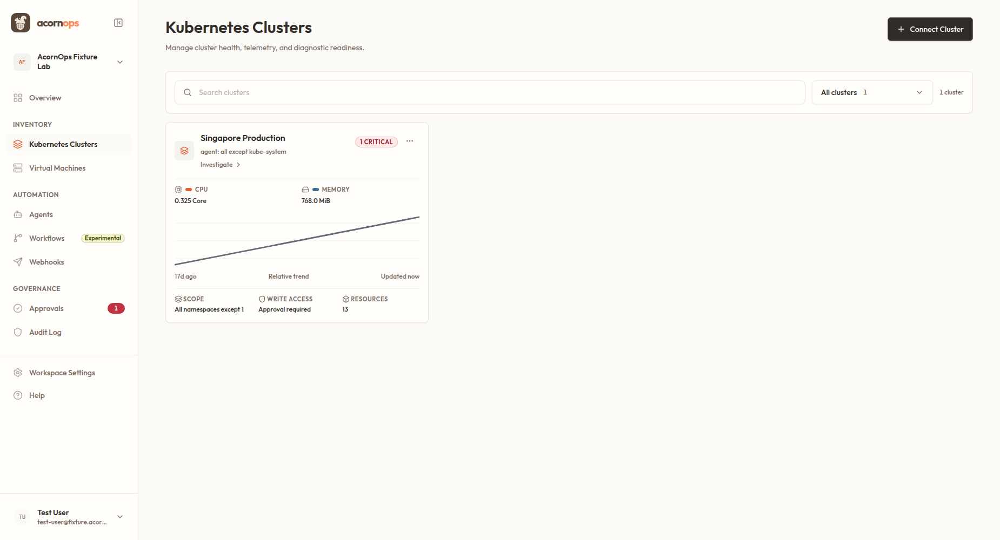
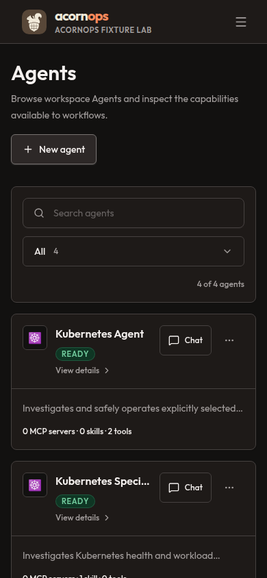
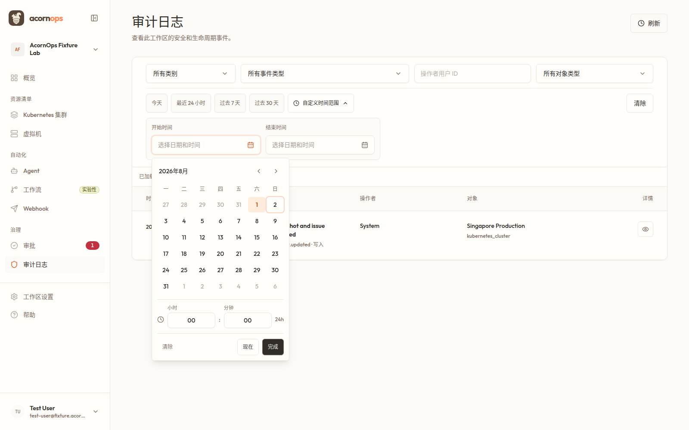
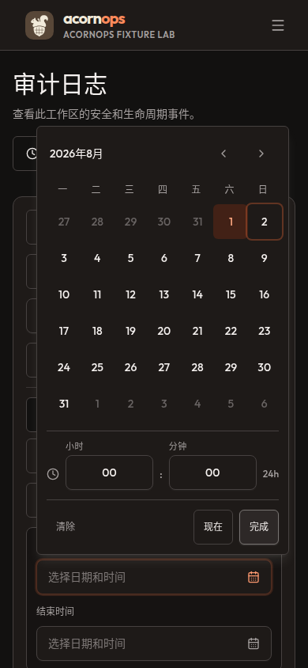
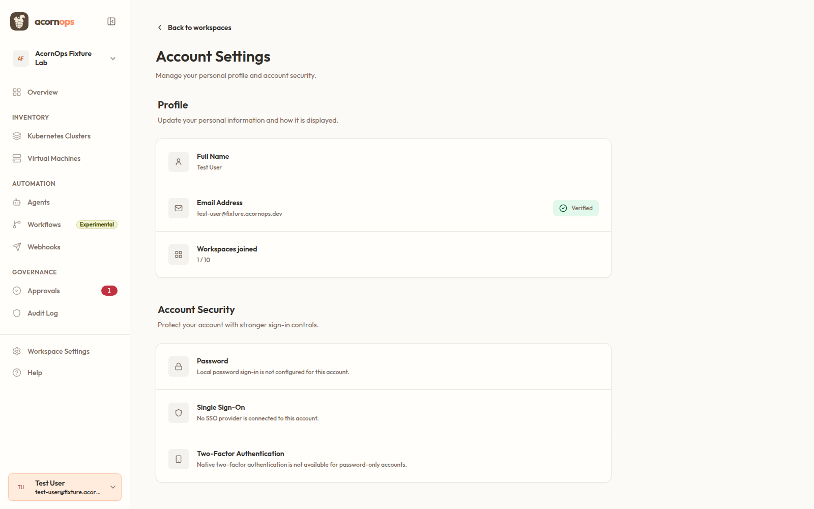
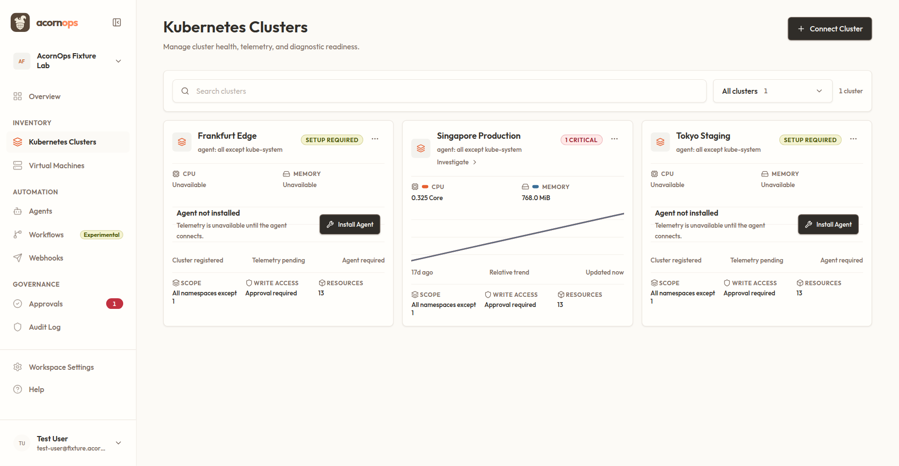

# Management Console Design-System Re-audit

## Verdict

The Management Console design-system remediation is complete for the audited
scope. All findings reproduced in this re-audit are fixed. The fresh 39-route
contract has zero WCAG 2.1 AA automation violations, zero normal-width
overflow, and zero 200% reflow overflow. No open P0, P1, P2, or P3
design-system findings remain.

The separate admin panel was intentionally excluded.

## Audited steps

### 1. Resource catalog, desktop light: healthy

- The catalog uses the shared full-width card-grid contract.
- At 1850 px, the grid resolves to three equal 487.3 px tracks with no fixed
  card maximum and no document overflow.
- Hierarchy, spacing, controls, status treatments, and card anatomy remain
  consistent with Management Console patterns.

### 2. Resource catalog, mobile dark: healthy

- The grid collapses to one 358 px track without clipping or horizontal
  scrolling.
- Dark-theme surfaces, borders, type, controls, and focusable actions retain
  clear visual separation.

### 3. Audit Log date-time range, desktop: healthy

- The `zh-CN` calendar is Monday-first and keyboard Home/End resolve to Monday
  2026-07-27 and Sunday 2026-08-02.
- Desktop triggers are 44 px; compact month controls and time inputs are 36 px,
  matching the shared pointer-density contract.

### 4. Audit Log date-time range, mobile: healthy

- The popup remains contained at 390 px with no page overflow.
- Triggers, month navigation, and time inputs expand to 44 px touch targets.
- Locale-aware weekday order and keyboard dates match the desktop behavior.

### 5. Account Settings selected state: healthy

- The selected account avatar now uses the shared soft-accent surface with
  readable accent text.
- Selected email copy now uses primary text instead of muted text on the tinted
  background.
- Axe changed from one serious contrast rule with two failing nodes (2.29:1
  and 4.44:1) to zero violations.

### 6. Three-card grid at 110% effective scale: healthy

- The 1329 px grid resolves to three equal 432.3 px tracks.
- Every card reports a 430 px client width and a 430 px scroll width.
- A screen-reader-only telemetry table no longer inherits the visible table's
  44rem minimum width into its card. Its semantic table remains available to
  assistive technology inside a clipped visually-hidden wrapper.

## Closed findings

| Previous severity | Finding | Resolution | Verification |
| --- | --- | --- | --- |
| P1 | Resource catalogs could miss the expected third column and constrain cards inconsistently. | Unified cluster, VM, and agent catalogs on the container-aware `27rem` shared grid contract. | Desktop, mobile, ultrawide, collapsed-sidebar, docked-assistant, and 110% browser checks pass. |
| P1 | A visually-hidden telemetry table widened a real cluster card at 110% scale. | Moved hidden semantic tables into clipped `sr-only` wrappers and neutralized their visible-table minimum width. | All three cards now have `scrollWidth === clientWidth`; focused Playwright suite is 4/4. |
| P1 | The Account Settings selected control failed text contrast. | Replaced saturated avatar and muted selected-email colors with shared readable selected-state tokens. | Axe reports zero Account Settings violations. |
| P2 | Date-time picker week ordering and compact control sizing were inconsistent across locale and viewport. | Made week boundaries locale-aware and standardized desktop/mobile control heights. | Desktop and mobile locale, keyboard, and geometry probes pass. |
| P2 | The production entry bundle exceeded the 350 KiB raw budget. | Split target-chat and control-plane code into stable application chunks. | Bundle budget passes across 48 chunks; largest chunk is 312,686 bytes. |
| P3 | A style-contract test exceeded the repository harness line budget. | Extracted the new primary-action assertions into a focused test file. | Harness checks pass. |

## Validation evidence

- `npm run ui:check`: passed.
- `npm run design:check`: passed across 437 source files.
- `npm run design:adoption`: zero violations and zero temporary exceptions.
- `npm run lint`: passed, including shared UI and application type checks.
- `npm run test`: 174 files and 819 tests passed.
- `npm run harness:check`: passed.
- `npm run contracts:check`: passed.
- `npm run build`: passed.
- `npm run bundle:check`: passed across 48 JavaScript chunks; largest chunk
  312,686 bytes.
- `npm run smoke:routes`: passed.
- Focused resource-card Playwright suite: 4/4 passed serially against a
  dedicated fixture server.
- Repository-native design snapshots: 23 passed, 1 intentionally skipped.
- Fresh canonical-route contract: 39/39 ready, zero axe violations, zero
  normal overflow, and zero 200% reflow overflow.

## Evidence limits and unrelated state

- Screenshots and route checks use realistic repository fixture data, not a
  live production control plane.
- Axe automation and keyboard probes do not replace manual screen-reader,
  voice-control, or other assistive-technology testing.
- The aggregate `npm run validate` command did not finish as one green command.
  A forced system-Chrome snapshot run produced a 4 px mobile-only geometry
  difference while the repository-native snapshot run passed. The full design
  route run also encountered concurrent snapshot changes and transient route
  races; a focused rerun of the affected canonical routes passed. The broad
  fixture suite still contains unrelated target-flow failures for telemetry,
  skills navigation, and viewer permissions.
- Concurrent MCP, chat, sidebar, overview, and snapshot edits were preserved
  and were not adopted or overwritten as part of this audit.

