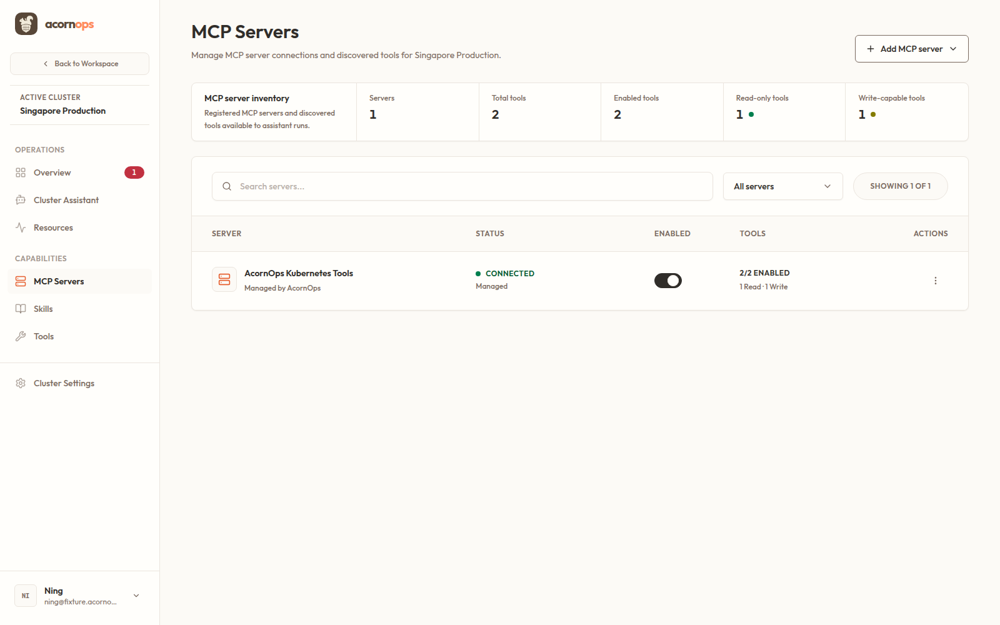
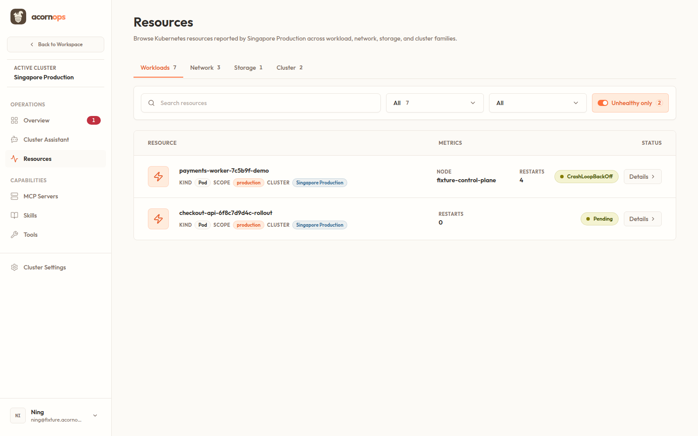
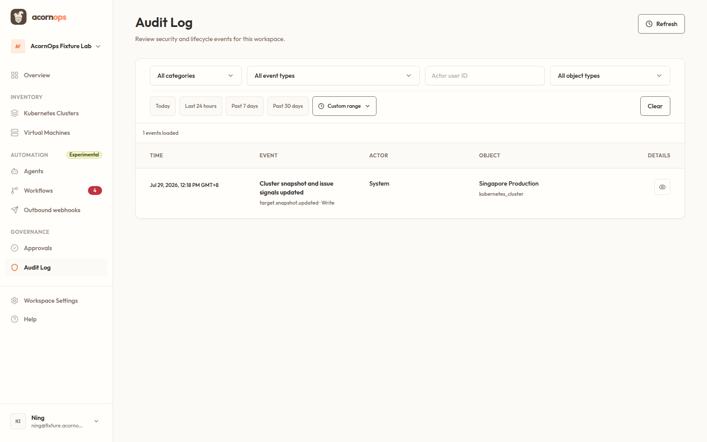
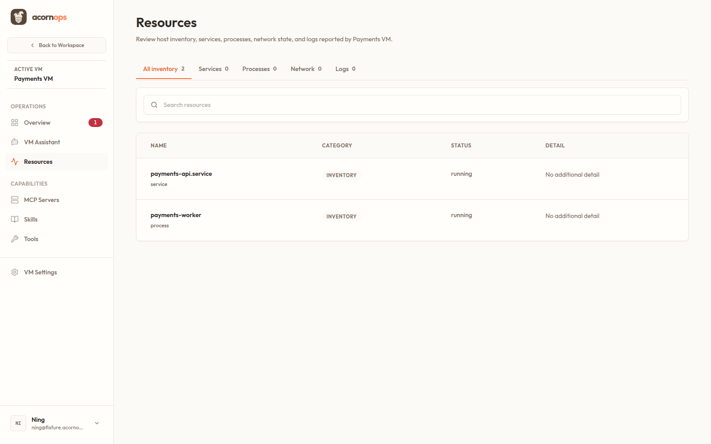

# Management Console design-system sweep

Date: 2026-07-29  
Scope: authenticated desktop routes at 1600 × 1000, rendered from the local fixture-backed application, plus source and design-token inspection.

## Verdict

The management console is broadly coherent, but it does **not** yet have complete design-system adherence across every screen.

The strongest consistency is in page titles, subtitles, section headings, panel headings, controls, borders, radii, and the warm neutral palette. The clearest remaining inconsistency is table and grid anatomy: the same 12 px label typography is used for most column headers, but three different header heights and padding models are visible.

The reported MCP Servers versus Resources difference is real. MCP Servers uses the shared standard table header; Resources uses a hand-built compact grid header. Audit Log, however, matches MCP Servers exactly at this viewport for header type, padding, height, and background. Audit Log can still feel different because its filter toolbar and row content are denser.

## Exact rendered comparison

| Surface | Header type | Font | Padding at 1600 px | Rendered height | Assessment |
|---|---|---:|---:|---:|---|
| MCP Servers | Shared standard | 12/600/16, uppercase | 20 px × 32 px | 56.5 px | Canonical |
| Audit Log | Shared standard | 12/600/16, uppercase | 20 px × 32 px | 56.5 px | Matches MCP exactly |
| Members, Skills, Tools | Shared standard | 12/600/16, uppercase | 20 px × 32 px | 56.5 px | Canonical |
| Schedules, Approvals | Shared dense | 12/600/16, uppercase | 16 px × 16 px | 48.5 px | Intentional for wide decision tables |
| Cluster Resources | Custom grid | 12/600/16, uppercase | 12 px × 20 px | about 40.5 px | Inconsistent anatomy |
| Cluster/VM Overview issues | Raw compact table | 12/600/16, uppercase | 12 px × 20 px | 40.5 px | Inconsistent anatomy |
| VM Resources | Raw compact table | 12/600/16, uppercase | 12 px × 20 px | 40.5 px | Inconsistent anatomy |
| VM Logs | Custom compact grid | 12/600/16, uppercase | 12 px × 16 px | about 40.5 px | Inconsistent anatomy |

### Visual evidence

#### Shared standard header: MCP Servers

#### Hand-built compact header: Cluster Resources

#### Shared standard header: Audit Log

#### Raw compact header: VM Resources

## Typography findings

### Standardized successfully

- Route titles render as 30 px / 600 / 36 px.
- Section titles render as 20 px / 600 / 28 px.
- Panel titles render as 16 px / 600 / 24 px.
- Row titles render canonically as 14 px / 600 / 20 px where the semantic role is used.
- Body text renders as 14 px / 400 / 24 px.
- Labels render as 12 px / 600 / 16 px with uppercase treatment.
- Every literal `h1`, `h2`, and `h3` inspected uses a canonical semantic typography role.
- Page title, subtitle, and leading page spacing are consistent across ordinary authenticated routes and embedded target routes.

### Still inconsistent

- Table row names use different roles:
  - MCP Servers and Members use the 16 px panel-title role.
  - Audit Log and VM Resources use the 14 px row-title role.
  - Skills and Tools use raw `text-sm font-semibold`.
- Resource metadata and statuses use raw `text-xs` and `text-sm` utilities instead of semantic roles, making rows feel tighter and heavier than the shared ledgers.
- MCP Servers, Skills, and Tools summary counts use raw `text-xl` with tight tracking rather than the canonical `type-data` role. The current size is the same, but the letter spacing and semantic contract differ.
- A static scan found 520 direct text-size utility occurrences across 122 production files: 290 `text-sm`, 199 `text-xs`, 21 `text-xl`, and 10 other sizes. Many are valid content or navigation uses, but the volume shows that semantic typography is not yet universally enforced.

## Component and layout findings

### Consistent

- Buttons, inputs, borders, radii, surface colors, focus treatment, and empty-state composition are broadly consistent.
- Top-level collection search/filter bars share the same 44 px control height and warm surface treatment.
- MCP Servers, Skills, and Tools are internally consistent with one another.
- Kubernetes and VM target shells mirror one another well.
- Runs, Event Triggers, Outbound Webhooks, Members, target MCP Servers, target Skills, and target Tools use the shared table/grid primitives.
- Schedules and Approvals use the documented dense mode appropriate to seven-or-more-column decision tables.

### Inconsistent or only partially standardized

- Cluster Resources, cluster/VM issue tables, VM Resources, and VM Logs recreate header layout and spacing instead of using the shared `DataTableHeaderCell` or `DataTableGridHeader`.
- Raw issue and VM resource tables omit the shared header primitive's `scope="col"` behavior.
- Audit Log's header is canonical, but its filter toolbar is deliberately denser than ordinary collections; that distinction is not currently explained by a named layout variant.
- Master/detail Catalog and Workflows screens are intentionally not ordinary ledgers and should not be forced into the table pattern.
- Chat transcript content and Markdown-rendered tables are content surfaces, not application ledgers, and should remain outside the ledger standard.
- Login is a separate brand composition and was not treated as the authenticated-shell baseline.

## Enforcement gap

`npm run design:check` passes across 379 source files, but the checker currently enforces only part of the system. It catches disallowed named palettes, very heavy font weights, broad uppercase/tracking utilities, tiny arbitrary sizes, and missing canonical heading roles. It does not catch:

- visible raw `<thead>` or `<th>` markup;
- custom table/grid header padding and height;
- raw `text-xs`, `text-sm`, and `text-xl` in semantic UI roles;
- row titles using panel-title typography;
- feature-specific ledgers that bypass the shared data-table primitives.

The passing check therefore confirms token guardrails, not complete cross-screen visual equivalence.

## Recommended normalization

1. Route every application ledger header through the shared table/grid header primitives.
2. Decide whether the 40.5 px compact resource header is intentional:
   - if yes, add and document a named shared `compact` density;
   - if no, migrate Resources, issue tables, and VM Logs to the standard density.
3. Reserve `dense` for the already documented wide decision tables.
4. Normalize table row names to `type-row-title`; reserve `type-panel-title` for panel/card headings.
5. Replace summary-count utility bundles with `type-data`, and replace status/metadata utility bundles with semantic roles.
6. Extend the design-system checker to flag visible raw table headers outside explicit exceptions and add a small cross-route visual regression suite for standard, dense, and compact variants.

## Screen-by-screen sweep

| # | Screen | Result |
|---:|---|---|
| 1 | Workspace Overview | Healthy |
| 2 | Agents | Healthy |
| 3 | MCP Catalog | Healthy; intentional master/detail layout |
| 4 | Workflows | Healthy; intentional master/detail layout |
| 5 | Runs | Healthy |
| 6 | Schedules | Healthy; documented dense table |
| 7 | Event Triggers | Healthy |
| 8 | Webhook Triggers | Healthy |
| 9 | Approvals | Limited by empty fixture; source uses documented dense table |
| 10 | Members | Structurally healthy; row name is larger than other ledgers |
| 11 | AI Settings | Healthy |
| 12 | Workspace Settings | Healthy |
| 13 | Outbound Webhooks | Healthy |
| 14 | Audit Log | Canonical header; intentionally denser filters/content |
| 15 | Kubernetes Clusters | Healthy |
| 16 | Cluster Overview | Needs normalization: custom compact issue table |
| 17 | Cluster Resources | Needs normalization: custom compact grid header |
| 18 | Cluster MCP Servers | Healthy shared header; row title is oversized |
| 19 | Cluster Skills | Healthy shared header; raw row-title utility |
| 20 | Cluster Tools | Healthy shared header; raw row-title utility |
| 21 | Cluster Chat | Healthy; separate transcript composition |
| 22 | Cluster Settings | Healthy |
| 23 | Virtual Machines | Healthy |
| 24 | VM Overview | Needs normalization: custom compact issue table |
| 25 | VM Resources | Needs normalization: raw compact table and mixed row typography |
| 26 | VM Services | Limited by empty fixture; shell is consistent |
| 27 | VM Processes | Limited by empty fixture; shell is consistent |
| 28 | VM Network | Limited by empty fixture; shell is consistent |
| 29 | VM Logs | Needs normalization: custom compact grid |
| 30 | VM MCP Servers | Healthy shared header; row title is oversized |
| 31 | VM Skills | Healthy shared header; raw row-title utility |
| 32 | VM Tools | Healthy shared header; raw row-title utility |
| 33 | VM Chat | Healthy; separate transcript composition |
| 34 | VM Settings | Healthy |
| 35 | Account Settings | Visually healthy; fixture produced expected external-integration API errors |
| 36 | Help | Healthy |
| 37 | Workspaces route | Fixture resolves to the same selected-workspace overview |

## Validation and limits

- Passed: `npm run design:check`.
- Captured and visually inspected: 37 authenticated desktop routes.
- Inspected: rendered computed styles, semantic typography roles, visible tables, controls, relevant shared primitives, and feature-owned table implementations.
- Not run: full `npm run validate`, because this was a read-only audit and no product code was changed.
- Not fully covered: mobile and dark-mode route sweeps, keyboard and screen-reader behavior, populated fixtures for Approvals/VM Services/VM Processes/VM Network, and the separate login brand composition.
- Repository status was already dirty before this audit. No existing product changes were modified; only this untracked `.audit/` evidence directory was added.
