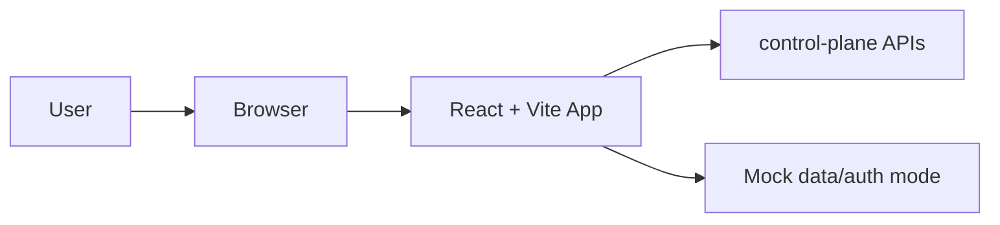
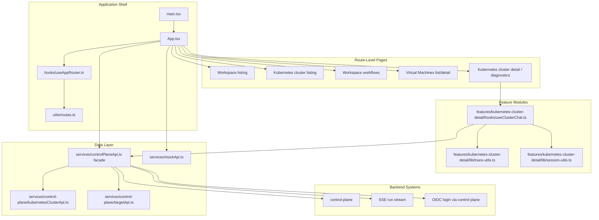

# Management Console Architecture

The management console is the operator-facing UI for:

1. workspace, Kubernetes cluster, and Virtual Machines navigation
2. Kubernetes cluster and VM health and diagnostics views
3. workspace-scoped workflow automation presentation
4. chat-driven troubleshooting sessions
5. run trace visualization
6. target tool configuration and cluster/VM onboarding

The UI presents Kubernetes clusters and Virtual Machines as sibling product domains. Kubernetes views keep Kubernetes-specific workload, namespace, pod-log, and write-tool controls. VM views use Linux/systemd VM APIs for registration, host inventory, findings, metrics, logs, MCP Servers, read-only troubleshooting chat, and VM Settings.
Workflows are top-level workspace resources with their own chat, run history, definition, and access panels. They are distinct from target chat and runbooks: target chat investigates a cluster or VM, runbooks are target prompt templates, and workflows represent governed workspace automation.

## High-Level Diagram

## Detailed Diagram

## Primary Responsibilities

1. render shareable workspace, Kubernetes cluster, Virtual Machines, and Workflows routes
2. fetch workspace, target-core, Kubernetes cluster, VM, tool, session, and run data from control-plane
3. present workflow definitions and planned workflow sessions without client-side authorization assumptions
4. create sessions and submit troubleshooting messages
5. stream run events and convert them into operator-readable traces
6. support both standalone mock mode and real control-plane mode

## Module Boundaries

- `src/components/kubernetes-clusters` owns Kubernetes cluster install/list components.
- `src/features/kubernetes-cluster-detail` owns the Kubernetes cluster detail surface, including workload/resource views, chat, MCP servers, and settings.
- `src/pages/WorkspaceWorkflowsPage.tsx` owns the workspace workflow library and detail presentation. Its model data is local until control-plane workflow APIs are implemented.
- `src/pages/VirtualMachinesPage.tsx` owns the VM list/detail surface, including registration, host resource views, logs, MCP servers, chat, and VM Settings.
- `src/services/control-plane/kubernetesClusterApi.ts` owns Kubernetes-specific lifecycle, inventory, log, session, tool, and MCP calls.
- `src/services/control-plane/targetApi.ts` owns shared target summary and target-scoped read calls.
- The sidebar is product-domain specific: Kubernetes Clusters and Virtual Machines have separate navigation and detail sidebars. There is no generic target sidebar.
